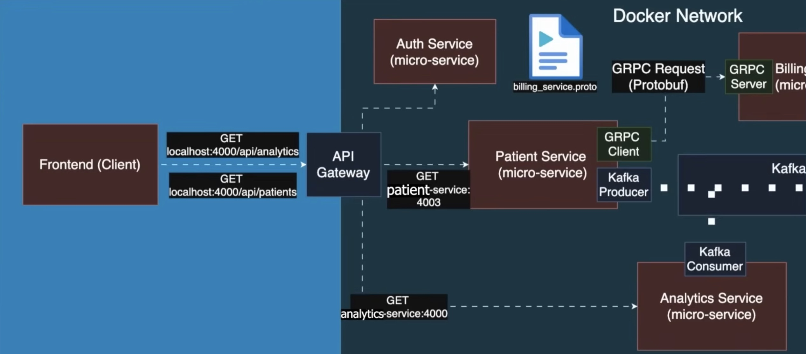
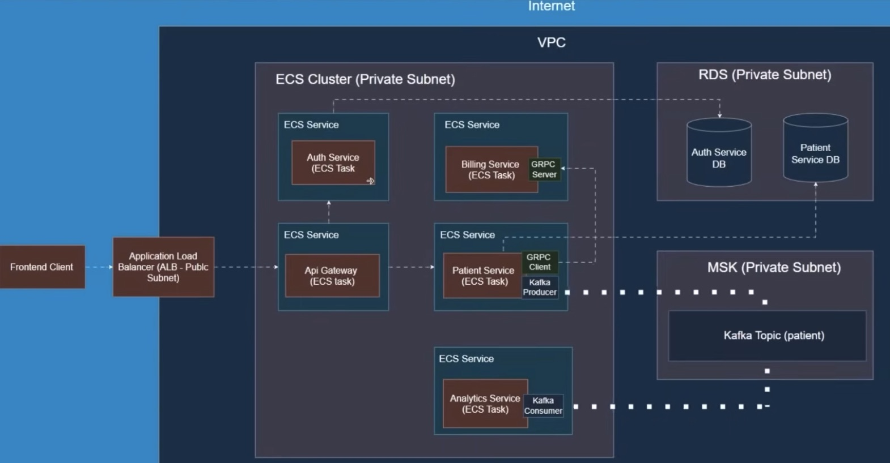

# Patient Management Microservices (Spring Boot)

A Java 21 / Spring Boot microservices system for **Patient CRUD** with a **gateway-first** architecture.

## Highlights

- **API Gateway** as the single entry point for clients (Spring Cloud Gateway).
- **Auth Service** for login + JWT issuance and validation (Spring Security + JWT).
- **Patient Service** with clean layering (Controller → Service → Repository), DTO mapping, request validation, and centralized error handling.
- **Billing Service (gRPC)** for fast service-to-service calls; patient creation triggers billing account creation.
- **Analytics Service (Kafka)** consumes patient events asynchronously (event-driven).
- **Dockerized local stack** with services on an internal Docker network (only the gateway needs to be exposed publicly).
- **AWS deployment architecture (simulated locally)** using **LocalStack** + **Java AWS CDK** to synthesize **CloudFormation** and provision a **VPC**, **ECS Fargate** services, an internet-facing **ALB** fronting the API Gateway, and managed backends (**RDS PostgreSQL**, **MSK Kafka**).

## Contents

- [Architecture](#architecture)
- [Services](#services)
- [Local setup](#local-setup)
- [API usage](#api-usage)
- [Testing](#testing)
- [Future improvements](#future-improvements)


## Architecture

### High-level flow

```text
Client
  │
  ▼
API Gateway  ──▶ Auth Service (login / validate JWT)
  │
  └──▶ Patient Service (CRUD)
         ├──▶ Billing Service (gRPC: create billing account on patient create)
         └──▶ Kafka Broker (publish PatientCreated event)
                    └──▶ Analytics Service (Kafka consumer)
```

### Diagrams

## System Architecture Diagram

## Infrastructure Architecture Diagram



## Services

### api-gateway

- **Single entry point** for client traffic.
- Routes requests to internal services (e.g., `/api/patients/**` → Patient Service, `/auth/**` → Auth Service).
- Planned/Work-in-progress: JWT validation via a custom Gateway Filter.

### auth-service

- `POST /auth/login` verifies credentials and returns a JWT.
- `GET /auth/validate` validates the JWT from the `Authorization: Bearer <token>` header.
- Password hashing via Spring Security; token signing uses a server-side secret key.

### patient-service

- CRUD endpoints for managing patients.
- Uses DTOs + Bean Validation (`@NotBlank`, `@Size`, etc.) to validate requests before hitting the DB.
- Uses **validation groups** so certain fields are required only for certain operations (example: registration date required on create, not on update).
- Centralized exception handling (`@ControllerAdvice`) returns clean 400 responses with readable error payloads.

### billing-service (gRPC)

- gRPC server that exposes a method to create a billing account.
- Patient Service calls Billing Service using generated protobuf stubs (low-latency service-to-service RPC).

### analytics-service (Kafka)

- Kafka consumer that ingests patient events.
- Patient Service publishes events to a Kafka topic so downstream services can consume asynchronously.

By design, services run on an internal Docker network; typically you only need to hit the **API Gateway**.

### Ports (common defaults)

- API Gateway: `4004`
- Patient Service: `4000` (internal)
- Billing Service (gRPC): `4001` (internal)

### Environment variables

- Use a `.env` file or Compose env vars for DB connection values and the JWT secret.
- Never commit real secrets to GitHub.

## API usage

### 1) Login (get a JWT)

```http
POST /auth/login
Content-Type: application/json

{
  "email": "admin@example.com",
  "password": "..."
}
```

### 2) Validate token

```http
GET /auth/validate
Authorization: Bearer <token>
```

### 3) Patient CRUD (through the gateway)

```http
GET /api/patients
Authorization: Bearer <token>
```

```http
POST /api/patients
Authorization: Bearer <token>
Content-Type: application/json

{
  "name": "Jane Doe",
  "email": "jane@example.com",
  "address": "123 Main St",
  "dob": "1998-05-20",
  "registrationDate": "2026-01-19"
}
```

```http
PUT /api/patients/{id}
Authorization: Bearer <token>
Content-Type: application/json

{
  "name": "Jane Doe",
  "email": "jane@example.com",
  "address": "456 Pine Ave",
  "dob": "1998-05-20"
}
```

```http
DELETE /api/patients/{id}
Authorization: Bearer <token>
```

## Testing

- **IntelliJ HTTP client**: `.http` request files for quick manual testing.
- **gRPC requests**: sample gRPC calls for Billing Service.
- WIP: **Rest Assured + JUnit** integration tests against the API Gateway.

## Future improvements

- Finish the Gateway JWT validation filter and expand role-based authorization (e.g., admin-only update/delete).
- Add OpenAPI/Swagger docs at the gateway.
- Add more integration tests and CI.
- Centralize protobuf definitions (shared module or separate repo) rather than copying proto files between services.
